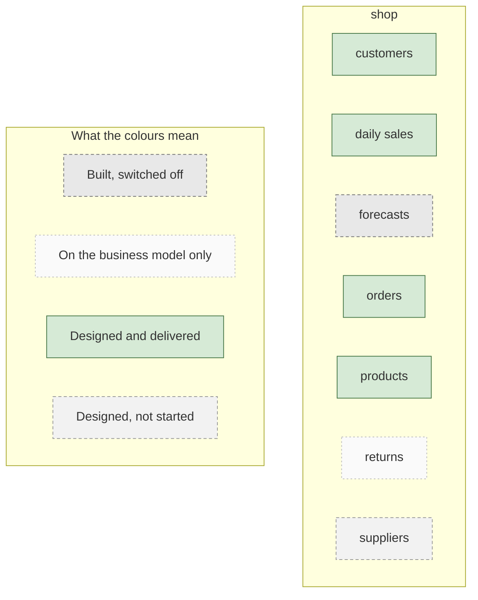

# The business model

What the business needs the warehouse to hold, in business language. No table names, no code.

The colours show what is actually true today, worked out from the repository rather than taken from the diagram. Where the authored diagram disagrees, that is listed at the bottom of this page.

## Every business entity

| Business name | Area | State | What that means | Table behind it |
|---|---|---|---|---|
| customers | shop | Designed and delivered | Working as intended. | wh_shop__customer_dim |
| daily sales | shop | Designed and delivered | Working as intended. | wh_shop__daily_sales_xa |
| forecasts | shop | Built, switched off | The code exists but is switched off, so nothing is being produced from it. | wh_shop__forecast_fact |
| orders | shop | Designed and delivered | Working as intended. | wh_shop__order_fact |
| products | shop | Designed and delivered | Working as intended. | wh_shop__product_dim |
| returns | shop | On the business model only | Agreed with the business as something the warehouse should hold, but not designed yet. This is the design backlog. | not built |
| suppliers | shop | Designed, not started | On the plan, no work done yet. | wh_shop__supplier_dim |

_Business model read as at 2026-09-08._

---

_Generated by Rittman Hunter, from Rittman Analytics._
