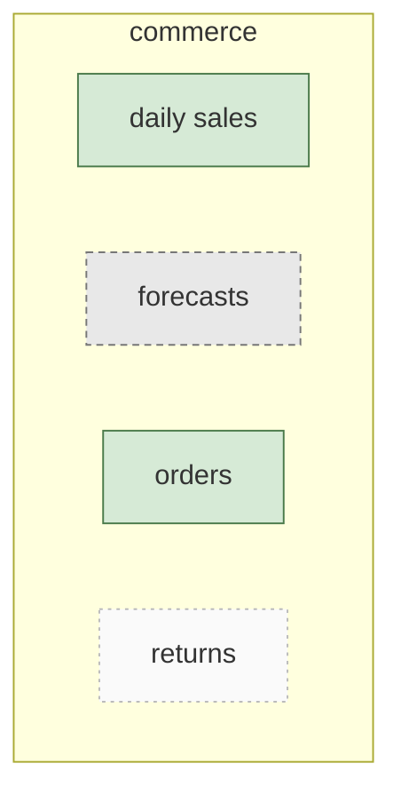
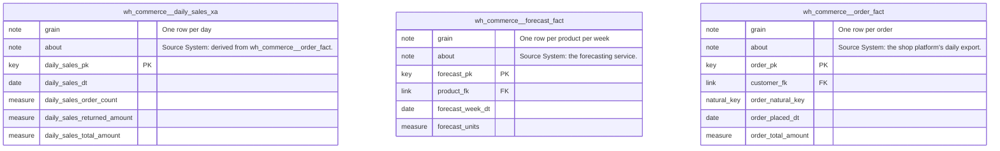
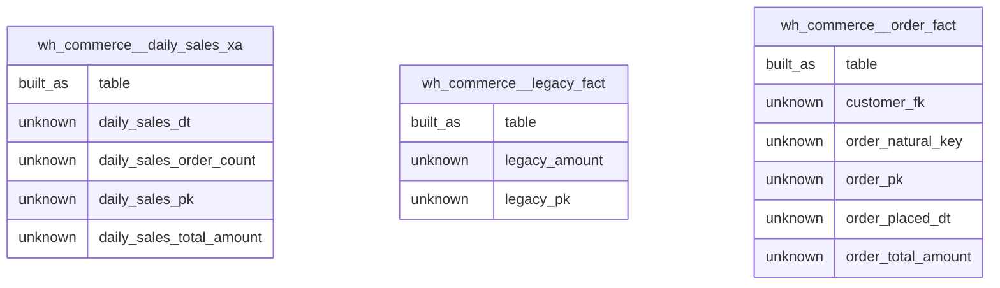
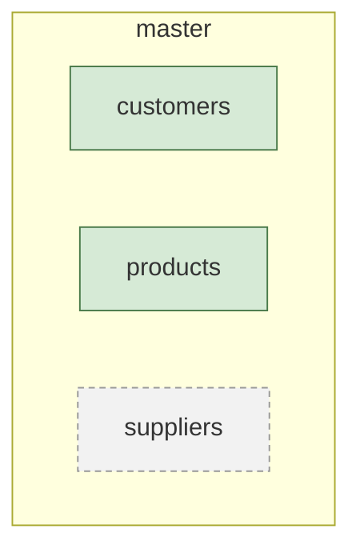
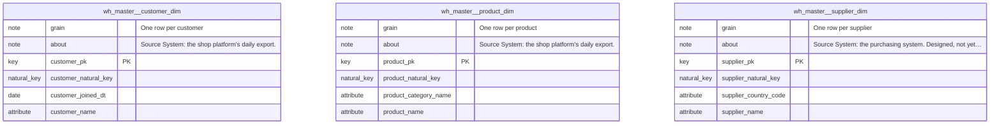
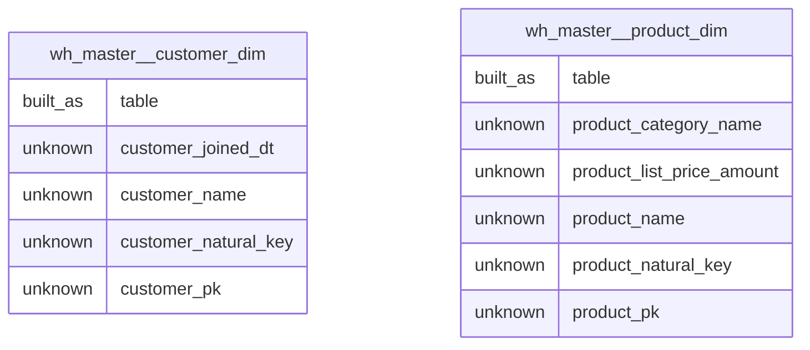

# The data model, at three levels

The same model described three ways. Each answers a different question, and comparing them is how a gap becomes visible.

| Level | What it shows | Who it is for |
|---|---|---|
| Business | The things the business needs held, in business language. No columns. | Anyone |
| Designed | The specification: columns grouped by what they are for, keys, relationships and what one row means. No warehouse detail. | Analysts and engineers |
| Built | What actually exists: the tables, their real columns and how they are built. | Engineers |

## Commerce

### Business view

### Designed view

### Built view

### Where the three disagree

| Entity | Business | Designed | Built | State |
|---|---|---|---|---|
| daily sales | yes | yes | yes | Designed and delivered |
| forecasts | yes | yes | switched off | Built, switched off |
| legacy | no | no | yes | Built off-plan |
| orders | yes | yes | yes | Designed and delivered |
| returns | yes | no | no | On the business model only |

## Master

### Business view

### Designed view

### Built view

### Where the three disagree

| Entity | Business | Designed | Built | State |
|---|---|---|---|---|
| customers | yes | yes | yes | Designed and delivered |
| products | yes | yes | yes | Designed and delivered |
| suppliers | yes | yes | no | Designed, not started |

_Model read as at 2026-09-08._

---

_Generated by Rittman Hunter, from Rittman Analytics._
