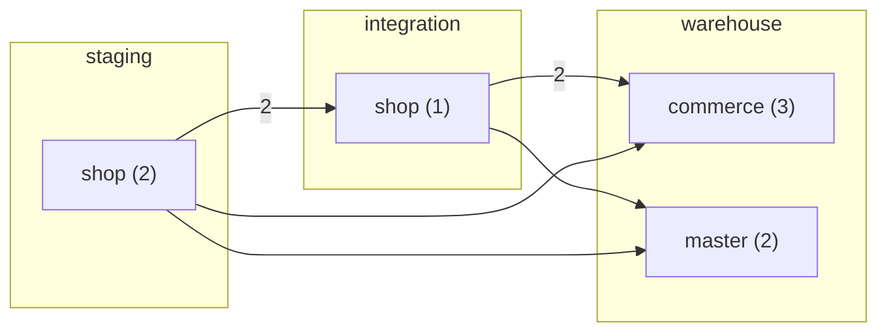
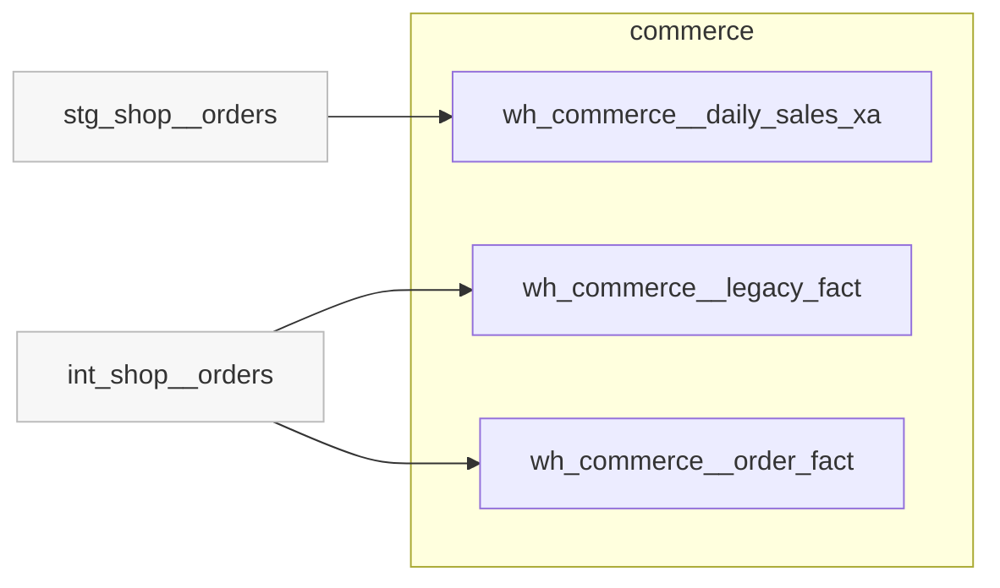
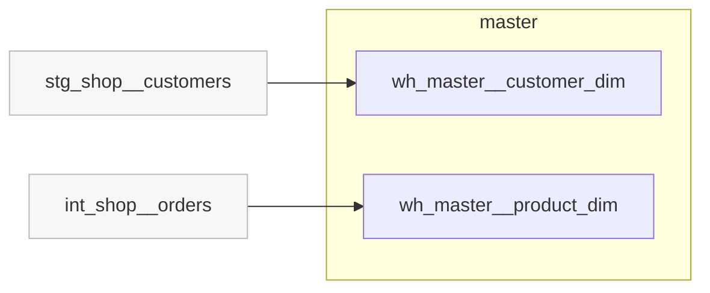
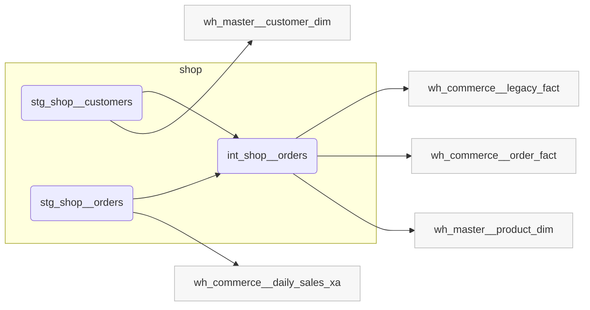

# How the tables fit together

One box per area, with the number of tables in it. Arrows show which areas feed which, and the number on an arrow is how many dependencies it stands for.

## By area

Rounded boxes are working steps rather than finished tables. Grey boxes sit outside the area and are shown for context.

### Commerce

### Master

### Shop

_Lineage built as at 2026-09-08._

---

_Generated by Rittman Hunter, from Rittman Analytics._
