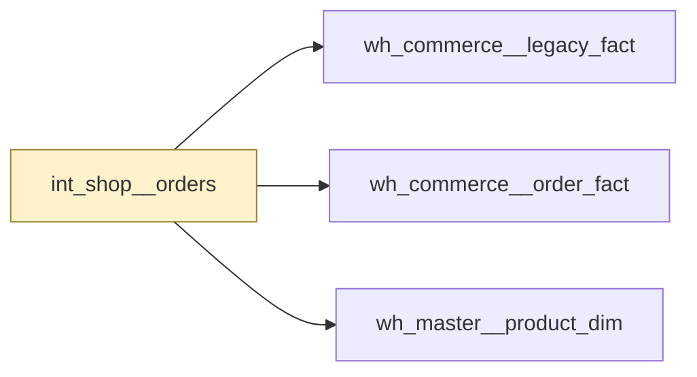

# int_shop__orders

`int_shop__orders`

Orders joined to the customer who placed them. A working step on the way to the order fact, not a table to report from. Grain is one row per order.

|  |  |
|---|---|
| Layer | integration |
| Area | shop |
| Built as | view |
| Enabled | yes |
| Temporary, verified or permanent | temporary |
| Decided by | register declaration |
| One row means | not stated |
| Owner | nobody named |
| Named as | unknown |
| Behaves like | not determined |
| State | - |
| First written by | unknown |
| First written | - |
| Last changed | - |
| File | `models/integration/int_shop/int_shop__orders.sql` |

## Columns

| Column | Type | Description | Tests |
|---|---|---|---|
| customer_natural_key | not recorded | The customer reference. | none |
| order_natural_key | not recorded | The order reference. | none |
| order_placed_dt | not recorded | Date the order was placed. | none |
| order_total_amount | not recorded | Order value before returns. | none |

## What depends on this

| What | Count | Names |
|---|---|---|
| Other tables | 3 | wh_commerce__legacy_fact, wh_commerce__order_fact, wh_master__product_dim |
| Report views | 0 | - |

## Findings

_Nothing to show here._

_Table read as at 2026-09-08._

---

_Generated by Rittman Hunter, from Rittman Analytics._
