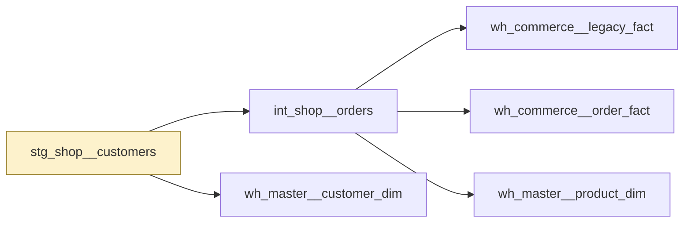

# stg_shop__customers

`stg_shop__customers`

Customers as the shop platform exports them. Grain is one row per customer. joined_at is the first order date rather than the account creation date.

|  |  |
|---|---|
| Layer | staging |
| Area | shop |
| Built as | view |
| Enabled | yes |
| Temporary, verified or permanent | temporary |
| Decided by | layer persistence |
| One row means | not stated |
| Owner | nobody named |
| Named as | unknown |
| Behaves like | not determined |
| State | - |
| First written by | unknown |
| First written | - |
| Last changed | - |
| File | `models/staging/stg_shop/stg_shop__customers.sql` |

## Columns

| Column | Type | Description | Tests |
|---|---|---|---|
| customer_joined_dt | not recorded | Date of the customer's first order. | none |
| customer_name | not recorded | Customer name. | none |
| customer_natural_key | not recorded | The customer reference from the shop platform. | none |

## What depends on this

| What | Count | Names |
|---|---|---|
| Other tables | 5 | int_shop__orders, wh_commerce__legacy_fact, wh_commerce__order_fact, wh_master__customer_dim, wh_master__product_dim |
| Report views | 0 | - |

## Findings

_Nothing to show here._

_Table read as at 2026-09-08._

---

_Generated by Rittman Hunter, from Rittman Analytics._
