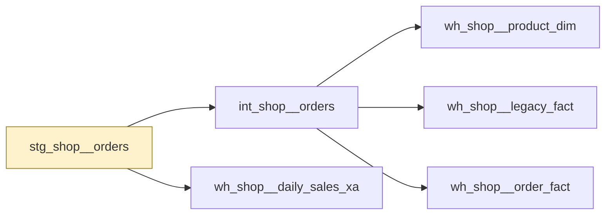

# stg_shop__orders

`stg_shop__orders`

Orders as the shop platform exports them. Grain is one row per order. order_id is used as the natural key; total is the order value before returns.

|  |  |
|---|---|
| Layer | staging |
| Area | shop |
| Built as | view |
| Enabled | yes |
| Temporary or permanent | temporary |
| Decided by | layer persistence |
| One row means | not stated |
| Owner | nobody named |
| Named as | unknown |
| Behaves like | not determined |
| State | - |
| First written by | unknown |
| First written | - |
| Last changed | - |
| File | `models/staging/stg_shop/stg_shop__orders.sql` |

## Columns

| Column | Type | Description | Tests |
|---|---|---|---|
| customer_natural_key | not recorded | The customer who placed the order. | none |
| order_natural_key | not recorded | The order reference from the shop platform. | none |
| order_placed_dt | not recorded | Date the order was placed. | none |
| order_total_amount | not recorded | Order value before returns. | none |

## What depends on this

| What | Count | Names |
|---|---|---|
| Other tables | 5 | int_shop__orders, wh_shop__daily_sales_xa, wh_shop__legacy_fact, wh_shop__order_fact, wh_shop__product_dim |
| Report views | 0 | - |

## Findings

| How serious | What is wrong | Why it matters | Where |
|---|---|---|---|
| Tidy up | stg_shop__orders selects every column from a raw source on line 13 | A column added at the source appears in stg_shop__orders without anyone deciding to take it, and a renamed one disappears. Reports built on it change shape with no change made here. | models/staging/stg_shop/stg_shop__orders.sql:13 |

_Table read as at 2026-09-08._

---

_Generated by Rittman Hunter, from Rittman Analytics._
