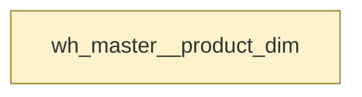

# products

`wh_master__product_dim`

Warehouse product dimension. Grain is one row per product. Carries the current list price.

|  |  |
|---|---|
| Layer | warehouse |
| Area | master |
| Built as | table |
| Enabled | yes |
| Temporary, verified or permanent | permanent |
| Decided by | layer persistence |
| One row means | One row per product |
| Owner | commerce |
| Named as | dimension |
| Behaves like | not clear from its columns (closest guess fact, confidence 0.3, below the 0.7 needed to say) |
| State | Designed and delivered |
| First written by | unknown |
| First written | - |
| Last changed | - |
| File | `models/warehouse/wh_master/wh_master__product_dim.sql` |

## Columns

| Column | Type | Description | Tests |
|---|---|---|---|
| product_category_name | not recorded | Category the product sits in. | none |
| product_list_price_amount | not recorded | Current list price. | at_least_one |
| product_name | not recorded | Product name. | none |
| product_natural_key | not recorded | The product reference. | none |
| product_pk | not recorded | Surrogate key for the product. | none |

## What depends on this

| What | Count | Names |
|---|---|---|
| Other tables | 0 | - |
| Report views | 0 | - |

## Findings

| How serious | What is wrong | Why it matters | Where |
|---|---|---|---|
| Needs attention | Nothing tests that product_pk is unique on wh_master__product_dim | Nothing checks that products holds one row per one row per product. If duplicates appear, every total built from it is overstated and nobody is told. nothing downstream depends on it. | models/warehouse/wh_master/wh_master__product_dim.sql |
| Needs attention | Nothing tests that product_pk is always populated on wh_master__product_dim | Rows with no key can appear in products. They drop out of joins silently, so figures come out low with no error to explain why. | models/warehouse/wh_master/wh_master__product_dim.sql |
| Worth fixing | The declared grain of wh_master__product_dim is not tested | The design says products holds one row per product, and nothing checks that it does. If the grain is wrong, figures double-count with no test to catch it. | models/warehouse/wh_master/wh_master__product_dim.sql |
| Worth fixing | wh_master__product_dim is built and stored but nothing reads it | products is rebuilt on every run and no model, report or dashboard uses the result. It costs money and delivers nothing until something consumes it. | models/warehouse/wh_master/wh_master__product_dim.sql |
| Worth fixing | wh_master__product_dim has 1 test but none of them prove a key | The tests on products check that columns are not entirely empty. None of them check that it has one row per thing, or that its references resolve. | models/warehouse/wh_master/wh_master__product_dim.sql |
| Worth fixing | 2 tests in the generated schema for wh_master__product_dim are not in the project: product_pk: not_null; product_pk: unique | The generated schema says these tests should exist on products, and dbt does not have them. Either the generated file has not been applied, or something removed them by hand. | models/warehouse/wh_master/wh_master__product_dim.sql |
| Worth fixing | wh_master__product_dim is named as a dimension but carries 1 numeric column | products is named as a lookup table but holds figures. Anyone joining it and summing those figures will multiply them by however many rows the join returns. Columns: product_list_price_amount. | models/warehouse/wh_master/wh_master__product_dim.sql |
| Tidy up | wh_master__product_dim has 1 column the design does not include: product_list_price_amount | products holds columns nobody designed, so they are undocumented and their business meaning is not recorded anywhere. | models/warehouse/wh_master/wh_master__product_dim.sql |
| Tidy up | wh_master__product_dim holds 1 column in the warehouse that the design does not include: product_list_price_amount | The warehouse picture taken by Droughty shows columns on products that nobody designed, so their business meaning is not recorded. | analytics_warehouse/docs/data_model_design/physical_model.dbml |

_Table read as at 2026-09-08._

---

_Generated by Rittman Hunter, from Rittman Analytics._
