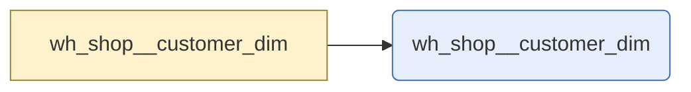

# customers

`wh_shop__customer_dim`

_No description has been written for this table._

|  |  |
|---|---|
| Layer | warehouse |
| Area | shop |
| Built as | table |
| Enabled | yes |
| Temporary or permanent | persistent |
| Decided by | layer persistence |
| One row means | One row per customer |
| Owner | nobody named |
| Named as | dimension |
| Behaves like | not clear from its columns (closest guess fact, confidence 0.3, below the 0.7 needed to say) |
| State | Designed and delivered |
| First written by | unknown |
| First written | - |
| Last changed | - |
| File | `models/warehouse/wh_shop/wh_shop__customer_dim.sql` |

## Columns

| Column | Type | Description | Tests |
|---|---|---|---|
| customer_joined_dt | not recorded | Date of the customer's first order. | none |
| customer_name | not recorded | Customer name. | none |
| customer_natural_key | not recorded | The customer reference. | none |
| customer_pk | not recorded | Surrogate key for the customer. | unique |

## What depends on this

| What | Count | Names |
|---|---|---|
| Other tables | 0 | - |
| Report views | 1 | wh_shop__customer_dim |

## Findings

| How serious | What is wrong | Why it matters | Where |
|---|---|---|---|
| Needs attention | 1 test declared for wh_shop__customer_dim never reached the generated schema: customer_pk: not_null | Someone wrote these tests into the Droughty config on purpose and the regeneration dropped them without saying so. customers is being tested less than whoever configured it believes. | models/warehouse/wh_shop/wh_shop__customer_dim.sql |
| Needs attention | Nothing tests that customer_pk is always populated on wh_shop__customer_dim | Rows with no key can appear in customers. They drop out of joins silently, so figures come out low with no error to explain why. | models/warehouse/wh_shop/wh_shop__customer_dim.sql |
| Worth fixing (silenced) | wh_shop__customer_dim has no description | Nobody reading the catalogue can tell what customers is for or whether it is the right table to use. 6 report fields depend on it. | models/warehouse/wh_shop/wh_shop__customer_dim.sql |
| Worth fixing | wh_shop__customer_dim skips the integration layer to read stg_shop__customers | customers reaches back past the layer that normally cleans and checks this data, so those checks do not apply to what it reads. | models/warehouse/wh_shop/wh_shop__customer_dim.sql |
| Worth fixing | wh_shop__customer_dim names no owner | There is nobody to ask about customers and nobody to route a problem with it to. It is a persistent table, and 6 report fields depend on it. | models/warehouse/wh_shop/wh_shop__customer_dim.sql |
| Worth fixing | 1 test in the generated schema for wh_shop__customer_dim are not in the project: customer_name: at_least_one | The generated schema says these tests should exist on customers, and dbt does not have them. Either the generated file has not been applied, or something removed them by hand. | models/warehouse/wh_shop/wh_shop__customer_dim.sql |
| Tidy up (suggestion) | wh_shop__customer_dim is named as a dimension, and its shape neither clearly agrees nor disagrees | Hunter could not tell from its columns whether customers really is a dimension. Worth a human look rather than a change. Evidence: 0 foreign keys, 0 columns to add up, 1 descriptive column, a date grain (judged from names, since column types were not available). | models/warehouse/wh_shop/wh_shop__customer_dim.sql |
| Tidy up | wh_shop__customer_dim feeds 1 report view but declares no exposure | Nothing in the project records that reports depend on customers, so anyone changing it has no way to see what they would break. | models/warehouse/wh_shop/wh_shop__customer_dim.sql |

_Table read as at 2026-09-08._

---

_Generated by Rittman Hunter, from Rittman Analytics._
