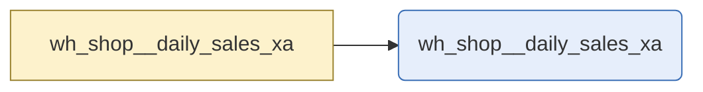

# daily sales

`wh_shop__daily_sales_xa`

Daily order totals for the shop. Grain is one row per day. Reads staging directly rather than going through the integration layer.

|  |  |
|---|---|
| Layer | warehouse |
| Area | shop |
| Built as | table |
| Enabled | yes |
| Temporary or permanent | persistent |
| Decided by | layer persistence |
| One row means | One row per day |
| Owner | commerce |
| Named as | aggregate |
| Behaves like | not clear from its columns (closest guess fact, confidence 0.6, below the 0.7 needed to say) |
| State | Designed and delivered |
| First written by | unknown |
| First written | - |
| Last changed | - |
| File | `models/warehouse/wh_shop/wh_shop__daily_sales_xa.sql` |

## Columns

| Column | Type | Description | Tests |
|---|---|---|---|
| daily_sales_dt | not recorded | The day summarised. | none |
| daily_sales_order_count | not recorded | Orders placed that day. | none |
| daily_sales_pk | not recorded | Surrogate key for the day. | none |
| daily_sales_total_amount | not recorded | Order value that day. | none |

## What depends on this

| What | Count | Names |
|---|---|---|
| Other tables | 0 | - |
| Report views | 1 | wh_shop__daily_sales_xa |

## Findings

| How serious | What is wrong | Why it matters | Where |
|---|---|---|---|
| Needs attention | wh_shop__daily_sales_xa has no tests of any kind | Nothing at all checks daily sales. Any problem in it reaches whoever reads the numbers before anyone who could fix it, and 7 report fields depend on it. | models/warehouse/wh_shop/wh_shop__daily_sales_xa.sql |
| Needs attention | wh_shop__daily_sales_xa is missing 1 column that the design specifies: daily_sales_returned_amount | daily sales was designed to hold these columns and does not. Anything that expected them, including a report built from the design, has nothing to read. | models/warehouse/wh_shop/wh_shop__daily_sales_xa.sql |
| Worth fixing | wh_shop__daily_sales_xa skips the integration layer to read stg_shop__orders | daily sales reaches back past the layer that normally cleans and checks this data, so those checks do not apply to what it reads. | models/warehouse/wh_shop/wh_shop__daily_sales_xa.sql |
| Worth fixing | wh_shop__daily_sales_xa is not described in the generated schema | daily sales was skipped when the schema was generated, so it has neither the generated tests nor the generated descriptions the rest of the project has. | models/warehouse/wh_shop/wh_shop__daily_sales_xa.sql |
| Tidy up | wh_shop__daily_sales_xa feeds 1 report view but declares no exposure | Nothing in the project records that reports depend on daily sales, so anyone changing it has no way to see what they would break. | models/warehouse/wh_shop/wh_shop__daily_sales_xa.sql |

_Table read as at 2026-09-08._

---

_Generated by Rittman Hunter, from Rittman Analytics._
