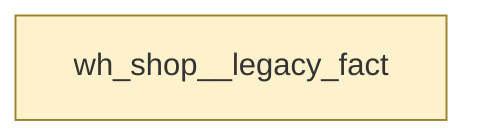

# legacy

`wh_shop__legacy_fact`

Kept from the previous warehouse while reports move across.

|  |  |
|---|---|
| Layer | warehouse |
| Area | shop |
| Built as | table |
| Enabled | yes |
| Temporary or permanent | persistent |
| Decided by | layer persistence |
| One row means | not stated |
| Owner | commerce |
| Named as | fact |
| Behaves like | not clear from its columns (closest guess fact, confidence 0.3, below the 0.7 needed to say) |
| State | Built off-plan |
| First written by | unknown |
| First written | - |
| Last changed | - |
| File | `models/warehouse/wh_shop/wh_shop__legacy_fact.sql` |

## Columns

| Column | Type | Description | Tests |
|---|---|---|---|
| legacy_amount | not recorded | A value carried over from the previous warehouse. | none |
| legacy_pk | not recorded | Surrogate key. | none |

## What depends on this

| What | Count | Names |
|---|---|---|
| Other tables | 0 | - |
| Report views | 0 | - |

## Findings

| How serious | What is wrong | Why it matters | Where |
|---|---|---|---|
| Needs attention | wh_shop__legacy_fact has no tests of any kind | Nothing at all checks legacy. Any problem in it reaches whoever reads the numbers before anyone who could fix it, and nothing downstream depends on it. | models/warehouse/wh_shop/wh_shop__legacy_fact.sql |
| Needs attention | wh_shop__legacy_fact names the table '`warehouse`.`old_shop`.`legacy_orders`' directly on line 17 | Because legacy does not go through dbt to reach this table, the dependency is invisible: it does not appear in the lineage, it is not built in the right order, and nothing warns you if the table it points at changes. | models/warehouse/wh_shop/wh_shop__legacy_fact.sql:17 |
| Worth fixing | wh_shop__legacy_fact is built but was never designed | legacy exists in production and appears on no design, so nothing records what it is for, what one row means or who owns it. If it should be there, add it to the design or record an approval in the register. | wh_shop__legacy_fact |
| Worth fixing | wh_shop__legacy_fact is built and stored but nothing reads it | legacy is rebuilt on every run and no model, report or dashboard uses the result. It costs money and delivers nothing until something consumes it. | models/warehouse/wh_shop/wh_shop__legacy_fact.sql |
| Tidy up | wh_shop__legacy_fact selects every column from '`warehouse`.`old_shop`.`legacy_orders`' on line 17 | A column added at the source appears in legacy without anyone deciding to take it, and a renamed one disappears. Reports built on it change shape with no change made here. | models/warehouse/wh_shop/wh_shop__legacy_fact.sql:17 |

_Table read as at 2026-09-08._

---

_Generated by Rittman Hunter, from Rittman Analytics._
