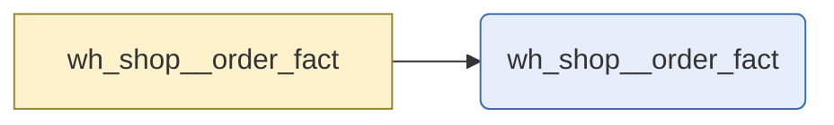

# orders

`wh_shop__order_fact`

Warehouse order fact. Built from int_shop__orders, which joins the shop platform's orders to the customer who placed them. Carries the order value before returns; returns are held separately.

|  |  |
|---|---|
| Layer | warehouse |
| Area | shop |
| Built as | table |
| Enabled | yes |
| Temporary or permanent | persistent |
| Decided by | layer persistence |
| One row means | One row per order |
| Owner | commerce |
| Named as | fact |
| Behaves like | not clear from its columns (closest guess fact, confidence 0.65, below the 0.7 needed to say) |
| State | Designed and delivered |
| First written by | unknown |
| First written | - |
| Last changed | - |
| File | `models/warehouse/wh_shop/wh_shop__order_fact.sql` |

## Columns

| Column | Type | Description | Tests |
|---|---|---|---|
| customer_fk | not recorded | The customer who placed it. | relationships |
| order_natural_key | not recorded | The order reference from the shop platform. | none |
| order_pk | not recorded | Surrogate key for the order. | not_null, unique |
| order_placed_dt | not recorded | Date the order was placed. | none |
| order_total_amount | not recorded | Order value before returns. | none |

## What depends on this

| What | Count | Names |
|---|---|---|
| Other tables | 0 | - |
| Report views | 1 | wh_shop__order_fact |

## Findings

| How serious | What is wrong | Why it matters | Where |
|---|---|---|---|
| Needs attention | 1 report field in view wh_shop__order_fact read columns wh_shop__order_fact no longer produces: order_channel_name -> order_channel_name | These report fields are broken now. Anyone opening a report that uses them gets an error or a blank, and the cause is a column that was renamed or removed in wh_shop__order_fact. | analytics_warehouse/lookml/base/_base.layer.lkml |
| Worth fixing | 3 tests in the generated schema for wh_shop__order_fact are not in the project: customer_fk: at_least_one; order_natural_key: at_least_one; order_total_amount: at_least_one | The generated schema says these tests should exist on orders, and dbt does not have them. Either the generated file has not been applied, or something removed them by hand. | models/warehouse/wh_shop/wh_shop__order_fact.sql |
| Tidy up | wh_shop__order_fact feeds 1 report view but declares no exposure | Nothing in the project records that reports depend on orders, so anyone changing it has no way to see what they would break. | models/warehouse/wh_shop/wh_shop__order_fact.sql |
| Tidy up | wh_shop__order_fact holds 1 column in the warehouse that the design does not include: order_channel_name | The warehouse picture taken by Droughty shows columns on orders that nobody designed, so their business meaning is not recorded. | analytics_warehouse/docs/data_model_design/physical_model.dbml |

_Table read as at 2026-09-08._

---

_Generated by Rittman Hunter, from Rittman Analytics._
