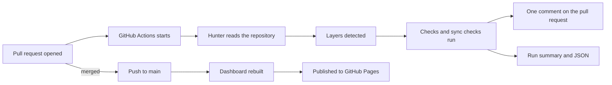

# From a pull request to the dashboard

What happens, in order, from the moment someone changes a model
to the moment a stakeholder sees the result. Nobody runs anything by hand.

## 1. Someone opens a pull request

Any change counts: a new model, an edited one, a LookML file, a design file, a
register entry. The workflow has no path filter, so nothing is missed because a
file sat in an unexpected place.

## 2. GitHub Actions starts five jobs

The workflow `hunter init` writes runs the score and the three sync checks, each
as its own job. They show as separate lines on the pull request, so one drifted
layer does not hide another.

| Job | Question it answers |
|---|---|
| Score | What state is the whole repository in? |
| LookML sync | Does the reporting layer still match the tables? |
| Droughty sync | Was the generated schema applied, and is it current? |
| Modelling sync | Does what exists match what was designed and asked for? |
| Publish | Only on a push to main. Puts the dashboard on GitHub Pages |

See [Run it on every pull request](ci.md).

## 3. Hunter reads the repository

Six sources, all files already in the checkout. No warehouse credential.

| Source | Required | What it adds |
|---|---|---|
| `manifest.json` from dbt | Yes | Tables, columns, tests, what feeds what |
| DBML design files | No | Whether what was built matches the design |
| Conceptual and logical Mermaid diagrams | No | Whether the design matches what the business asked for |
| LookML | No | Whether a renamed column will break a report |
| Committed Droughty output | No | Whether generated tests and descriptions were applied |
| Git history | No | Who built what, and when |

Plus the register, `.hunter/register.yml`, which holds what people have decided:
owners, status, approvals, and silences with end dates.

A source that is missing turns its checks off and is named on the report as
not checked. It is never scored as zero.

## 4. Hunter works out the layers

The ruleset names the layers it expects: staging, integration, warehouse. If
the models directory holds a directory the ruleset does not name, Hunter treats
it as a layer of its own, groups its models, and says so on the report. A new
part of the warehouse appears without anyone editing configuration.

A found layer is held to no layer rules until it is declared, because Hunter
knows the models are grouped, not what the group should look like. See
[Configuration](configuration.md#layers-hunter-finds-on-its-own).

## 5. Each table gets a status

Temporary, verified or permanent. The register decides first; otherwise Hunter
infers it from the layer and the materialisation, and records which signal
decided.

| Status | Meaning |
|---|---|
| Temporary | A working step, or a table only ever meant to run once. Carries a review date |
| Verified | Meant to stay, and a named person has confirmed it |
| Permanent | Meant to stay. Inferred from the layer |

See [Mark a table temporary, verified or permanent](register.md).

## 6. The checks run

77 rules. Each one examines a set of tables and reports the ones that fail,
with a sentence saying what breaks if it is left. The three sync checks are
slices of the same rules, so the checks and the dashboard cannot disagree.

## 7. The pull request gets one comment

The score and its movement, the findings on what this change touched, what
those tables reach downstream, and a diagram of the affected tables. One
comment, edited in place on each push.

Each sync check also writes a run summary and one comment of its own.

## 8. On merge, the dashboard is rebuilt and published

A push to main runs the same jobs, then builds the full site and publishes it to
GitHub Pages in the same repository. A stakeholder opens a link. See
[Publish the dashboard](publish.md).

The same run happens every Monday morning, to catch drift that arrived from
outside a pull request: a change made in Looker, or a design file edited
directly.

## What the stakeholder sees

One page, seven bands, top to bottom.

| Band | What it answers |
|---|---|
| The headline | The score, the grade, and four figures that can be acted on |
| Checklist | Statements that should hold, grouped by what they check, each saying how many hold and naming what does not |
| Roadmap | Every table in one lane: planned, being built, live, temporary by design, being phased out, retired. Each live table says whether it is verified, permanent or temporary |
| Modelling alignment | The same entities at the business, logical and physical levels, with the breaks marked |
| Model diagrams | The business model, the data flow, and the physical design, as drawn |
| Data flow | Which tables feed which, from raw sources to Looker, coloured by health |
| Table readiness | One row per built table: status, described, owned, tested, in Looker, and what it still needs |

[See it on the example](example/dashboard.md).

## What Hunter never does

No writes to the warehouse. No commits, branches or pull requests. No row-level
data read, stored or published. These are licence terms.
